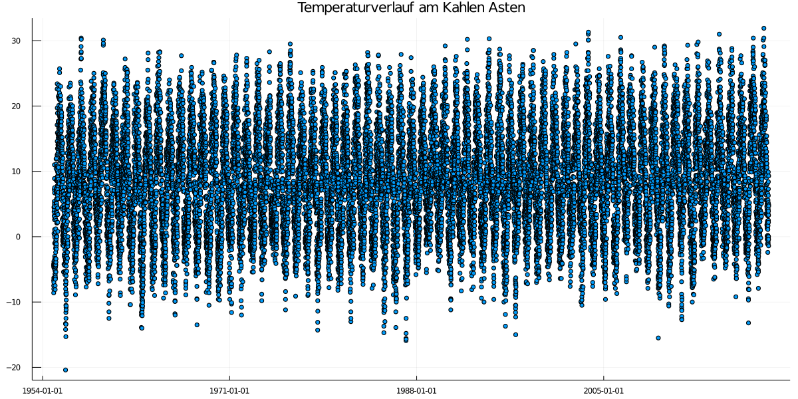
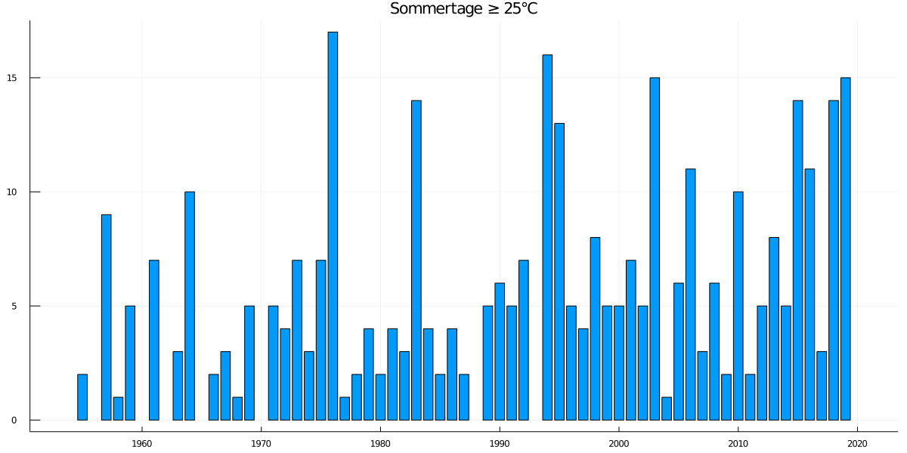

### Hi, hier geht es ums Wetter

#Hallo!

Der [Deutsche Wetterdienst](https://dwd.de) stellt in einem Open Data Projekt die Wetterdaten seiner Wetterstationen zur Verfügung. :+1 

In einem ersten zuge wurden die Wetterdaten des [Kahler Asten](https://www.openstreetmap.org/#map=18/51.18016/8.48942) von mit ausgewertet. Der Datensatz beginnt am **01.01.1955** und reicht bis zum **31.12.2019**.
Die Rohdaten reichen zurück bis ins Jahr 1929 sind aber sehr lückenhaft.  Aus diesem Grund habe ich sie in dieser Darstellung zunächst nicht berücksichtigt. So fehlen z.B. zwischen 1944 und 1954 die Daten komplett.

####Die Temperaturdaten
Dem Chart liegen die jeweiligen Tageshöchstwerte zugrunde. 

Ein klarer Trend ist aus den Daten nicht zu erkennen. 

####Sommertage
Ein Sommertag is ein Tag mit Tageshöchstwerten ≥ 25°C.

####Die Top Ten der Temperaturen
  Datum    │ Temperatur
----------------|------------
2019-07-25  | 31.9       
2003-08-12  │ 31.3       
2003-08-07  │ 31.0       
2015-07-04  │ 31.0       
2006-07-20  │ 30.5        
2018-08-07  │ 30.4       
2019-07-24  │ 30.4       
1994-08-05  │ 30.3       
1992-08-09  │ 30.2       
2003-08-08  │ 30.1       

hhh

