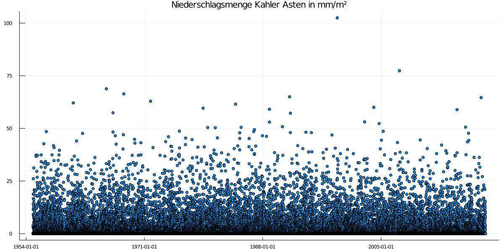
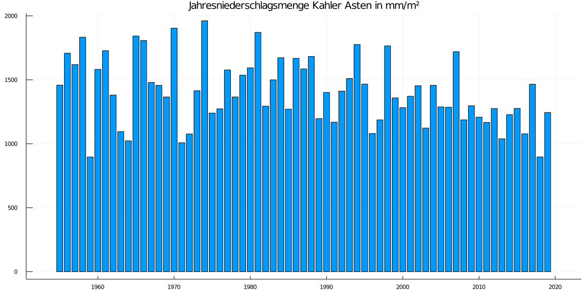

### Hi, hier geht es ums Wetter

Der [Deutsche Wetterdienst](https://dwd.de) stellt in einem Open Data Projekt die Wetterdaten seiner Wetterstationen zur Verfügung. 

In einem ersten Anlauf wurden die Wetterdaten des [Kahler Asten](https://www.openstreetmap.org/#map=18/51.18016/8.48942) von mit ausgewertet. Der ausgewertete Datensatz beginnt am **01.01.1955** und reicht bis zum **31.12.2019**.
Die Rohdaten reichen zurück bis ins Jahr 1929 sind aber sehr lückenhaft.  Aus diesem Grund habe ich sie in dieser Darstellung zunächst nicht berücksichtigt. Durch Kapfhandlungen am Ende des Zweiten Weltkrieges wurde die Station sehr stark zerstört. Daher fehlen zwischen 1944 und 1954 die Daten komplett. Zum 01.01.1955 wurde der Betrieb dann wieder aufgenommen. 

In den betrachteten 64 Jahren wurde der tiefste Wert am 01.02.1956 mit -26.0°C aufgezeichnet. Der wärmste Tag war der 25.07.2019 mit 31,9°C. 

#### Die Temperaturdaten
Dem Chart liegen die jeweiligen Tageshöchstwerte zugrunde. 

 

#### Sommertage
Ein Sommertag ist ein Tag mit Tageshöchstwerten ≥ 25°C.

Bis zum Jahre 1970 kamen Sommertage auf dem Kahlen Asten immer wieder vor, aber es war unstetig. In den 1979er Jahre waren dann 2 bis 4 Tage über 25°C schon "Normal". Seit den 1990er Jahren sind es nun mehr schon 5 bis 7 Tage.Hier ergibt sich ein sehr klarer Trend. 

#### Die Niederschlagsmengen

Das erste Bild Zeigt die Niederschlagsmengen auf Tagesbasis in mm/m². Für die Darstellung in Bild zwei wurden die Jahresniederschlagsmengen errechnet. 
  

**Wird Fortgesetzt .....**